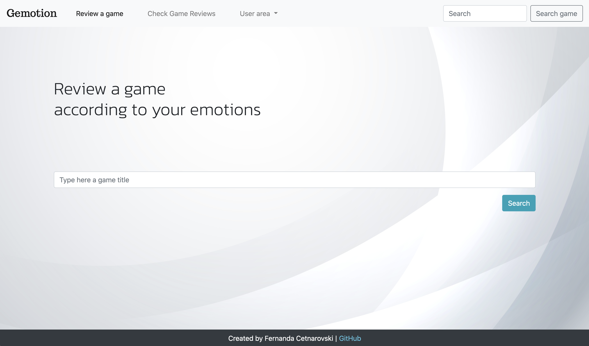
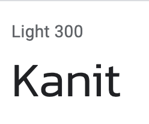
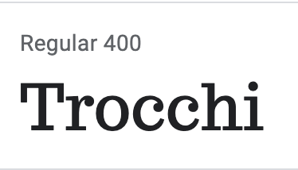
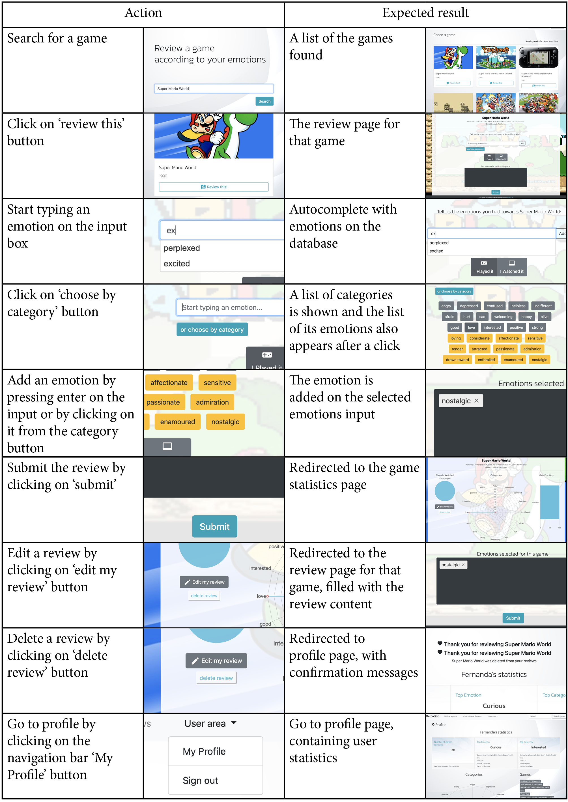
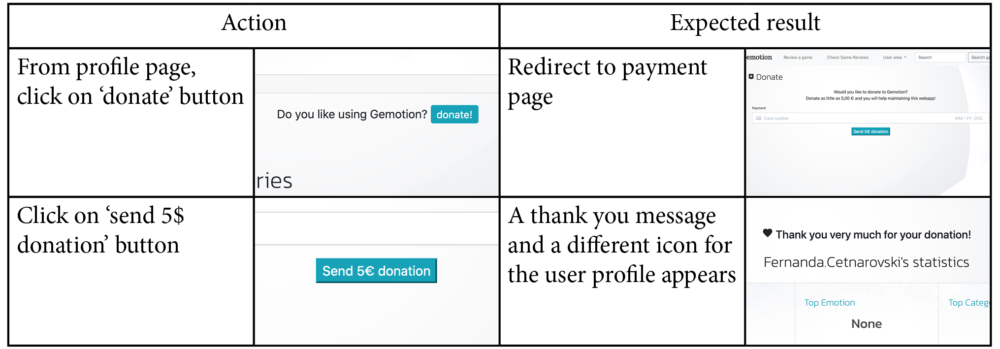

# Gemotion

Gemotion is a webapp to rate games according to your emotions.<br/>
[See here the live version](http://fgc-gemotion.herokuapp.com/)

The idea of this project is to use players’ emotions to create a new way to analyse video games. The webapp aims to collect data about how users feel playing or watching a specific title. 
Common game evaluations found online normally focus on genre, score or graphics. Even if those aspects are meaningful, they can create an image of the game based only on its surface. But when we’re looking at a game review online, we may look for something beyond what it looks from the outside.

Analyzing a game strictly by the emotion it triggers can create different connections among games, certainly in a wider spectrum. After all, when we are looking for a game recommendation our main goal is to find something that will make us feel in a certain way.

 
## UX




### STRATEGY PLANE

Website objectives:
- Collect data about games:
    - Most evaluated
    - Emotions the title evokes
    - Patterns emotions x genres
- Create a relational games x feelings database
- Analyse the data of the most common feelings to the best rated games
- Offer users a new tool/logic to analyse or recommend a game
- Create income through donations

User needs:
- Evaluate a game according to how they felt
- Check the general emotion/category of a game
- Create a profile
- Donate


### SCOPE PLANE

Functions and features

- Create user profile
    - Name
    - Email
    - List of reviews
    - Chart relating emotions
    - Top emotions and categories
    - Donate

- Reviews
    - search a game
    - add review
    - edit review
    - delete review
    - check game reviews

- Search through all reviewed games
    - latest reviewed
    - by emotion
    - by category
    - by game title

Apps:
- Profiles
    User MODEL
    - using django built in
    Profile MODEL
    - FK User
    - Donated status

- Games
    Game MODEL
    - PK (from external API RAWG)
    - Game title
    - Game platform
    - Game genre
    - Game images
    - Game description


- Reviews
    Category MODEL
    - PK
    - Category name
    Emotion MODEL
    - PK
    - FK emotion Category
    - Emotion name
    Review MODEL
    - PK
    - FK - Games
    - FK - Users
    - FK - Feelings


###### Future implementation

- Check other user’s evaluations
- Receive game recommendations
- Comments session on game reviews page


### STRUCTURE PLANE

Find Here the wire frames for the information architecture:

[Wireframes](https://fergabi17.github.io/gemotion/resources/wireframes/wireframes.html)

### SKELETON PLANE

This webapp uses bootstrap theme for colours and fonts.</br>
Additional fonts from google fonts:</br>
</br>
</br>
Font used for titles</br>

</br>
Font used for brand logo</br>
</br>

### SURFACE

Find the project live on https://fgc-gemotion.herokuapp.com/

User Stories:
- A user wants to:
    - Search for a game:
        They can type the game title:
        - on the index page
        - on the top navigation bar
    - Create a user:
        - From the navigation bar "Sign up"
        - From the game reviews page, if not logged
        - From the profile page, if not logged
    - Sign in:
        - From the navigation bar "Sign in"
        - From the game reviews page, if not logged
        - From the profile page, if not logged
    - Review a game:
        "Review this" buttons are available:
            - after searching this game
            - on the list of games reviewed page
            - on the game details page
    - Check the game details page:
        "Check this Review" buttons are available:
            - after searching this game (if there are reviews)
            - on the list of games reviewed page
            - on the profile page under "games reviewed"
    - Edit/delete a review:
        After logging in, they go to the game details page and, if the user already reviewed that game, a "edit review" and "delete" buttons will be available


## Technologies Used

- [Html](https://html.com)
    - The project uses HTML5, standard markup language for creating Web pages.

- [CSS](https://www.css3.info)
    - The project uses CSS to style the website.

- [Javascript](https://www.javascript.com/)
    - The project uses javascript for the website functionalities

- [Charts JS](https://www.chartjs.org/)
    - Charts JS was used to present user's data and global website data

- [Python](https://www.python.org/)
    - The project uses python to process data

- [Django](https://www.djangoproject.com/)
    - The project uses django framework for webapps

- [Jinja](https://jinja.palletsprojects.com/en/2.11.x/)
    - Jinja templates to render html from python

- [PostgreSQL](https://www.postgresql.org/)
    - Used to store the live database on heroku

- [SQLight3](https://www.sqlite.org/index.html)
    - Used to store the development database on heroku

- [Bootstrap](https://getbootstrap.com)
    - The project uses the grid system, fonts and styles from Bootstrap.

- [Google-fonts](https://fonts.google.com/)
    - Used as a source for titles and brand fonts

- [Freepik](https://freepik.com/)
    - Used as a source for background images

- [RAWG](https://rawg.io/apidocs)
    - Game database used to get all game information

- [rapidAPI](https://rapidapi.com/)
    - Website to find and test APIs used to find the best database to this project

- [Stripe](https://stripe.com/)
    - This project uses stripe to implement the payment functionality

- [CrispyForms](https://django-crispy-forms.readthedocs.io/)
    - This project uses crispy forms to render django forms on bootstrap-4

- [Google Chrome](https://www.google.com/chrome/)
    - This project used google CHROME browser and its developer tools

- [Mozilla Firefox](https://www.mozilla.org/en-US/firefox/new)
    - This project used MOZILLA FIREFOX browser for testing

- [Safari](https://www.apple.com/safari/)
    - This project used SAFARI browser for testing

- [Visual Studio Code](https://code.visualstudio.com/)
    - This project was built using Visual Studio Code IDE

- [Adobe XD](https://www.adobe.com/ie/products/xd.html)
    - This project used Adobe XD to plan the wireframes and information architecture

- [Git](https://git-scm.com/)
    - The project used GIT for Version Control

- [GitHub](https://github.com/)
    - This project used GITHUB for files repository

- [Html validator](https://validator.w3.org/nu/#textarea)
    - This tool was used to validate the website's HTML code

- [Css validator](https://jigsaw.w3.org/css-validator/validator)
    - This tool was used to validate the website's CSS code
    

## Testing


### The games database chicken API x RAWG 

To develop a game reviewing database, the first thing needed was data about those games. After researching something "easy" to use, I found the chicken coop gaming database on rapidapi.com. This website was very useful to test the API mechanics. In a short period of time, I had tested the game search and game details functionalities on my on python test file, found on tests/chickenAPI.

Happy with the functionality I was going to work with, I jumped to Adobe XD to plan the [wireframes](https://fergabi17.github.io/gemotion/resources/UX/wireframes/wireframes.html) based on how chicken coop worked. A couple of weeks later, with the planning ready and beginning of execution complete, I was surprised to find out that this API was no longer working. For some reason it was failing to return data requested, and I had to go back to look for a replacement API ASAP.

After a couple of days and tests, RAWG API was set as the new game database for this project. At the beginning this API seemed to be more complex that the first one since it was storing a lot more data. But with the help of rapidapi.com, I could understand this new API's behavior and start setting an even richier database than I was planning to have.

### Naming emotions and creating fixtures

The core of this webapp are the reviews, and reviews are based on emotions. To have those emotions selected and than set into categories, I used a psychology [website](http://www.psychpage.com/learning/library/assess/feelings.html) as a base and edited those according to what seemed more appropriate for the gaming experience. This was more challenging than expected! Seeing emotions on a list one beside the other is different that testing its use on the website's layout. Because of this, the emotions list was a work in progress for a while, and I tested them directly on the website to understand how the emotions presented were the appropriate ones.

The emotions list and their categories were added to the database using fixtures. Considering there were 192 emotions in 16 categories at the end, to manually build and edit fixtures would be a quite extensive work. This way, I built a side tool: a python script that would read a csv and create the json file with the list of emotions needed. This way I could constantly test the review functionality and quickly edit fixtures when needed. You can find this tool on resources/fixture-builder


### Review page

One of the most laborious parts of this webapp was the review page. Initially planned to be a simple form with checkboxes for each emotion (you can check this on the [wireframes](https://fergabi17.github.io/gemotion/resources/wireframes/wireframes.html)), at the production stage this seemed too overwhelming. Considering 192 emotions, it would be a very discouraging and even boring form. Since this webapp was aiming to have a modern look, I looked for other options that would be more motivating to the users add their inputs.

- input autocomplete
The input autocomplete was the first idea to make a clean review page. To build this functionality, I used the following [video](https://www.youtube.com/watch?v=-oLVZp1NQVE&ab_channel=CodeBand), so the autocomplete would be directly linked to the list of emotions on the database. To show the selection of emotions made, I created a board with tags based on this [video](https://www.youtube.com/watch?v=ha4xwcJXwow&ab_channel=FrontendTips). With the help of some javascript, adding new emotions is now more visually appealing than with the long form. But during tests realized, a blank text input could look a bit scary for less creative people, and the review process could be very limited. Realized this, I acknowledged the need of a list from where users could actually choose from.

- collapse categories
Simply creating a list of emotions to choose would bring us back at the beginning of the issue: this would look too overwhelming. Looking on Bootstrap documentation, I found the collapse categories that looked the perfect match for what I was trying to reach. Even though this functionality can be easily applied, on gemotion this became a little bit more complex because two levels of collapse were needed: first to reveal categories and a second to reveal the group of emotions. After checking some tips on [stackoverflow](https://stackoverflow.com/) of how to build django templates with loops and the collapse functionality I could figure out how to use the forloop.counter to match the button with the correct list of emotions and the data-parent html attribute to make the collapse elements open in the same position.

### Charts settings

Charts JS is an awesome tool to create charts, I was very happy with it. At the beginning only one chart was created on the game reviews page. For this, setting the chart was very easy and straightforward. As the game reviews page was growing, more information and different types of charts were added; from this point some problems on chart rendering started to appear. After carefully reading the documentation on chartsjs and this [tutorial](https://code.tutsplus.com/tutorials/getting-started-with-chartjs-radar-and-polar-area-charts--cms-28444) I could understand that different charts needed different settings, and they couldn't all be set together. It was evident there was a need of separating settings per chart on the javascript file.

### Profile logged x not logged

Since the wireframes planning, the profile page was intended to be showed for logged and not logged users. For the logged user it would show a statistics panel and chart about their reviews. For not logged or not users, it would show the same page with no statistics and some question marks in place of content. This idea would be to show not users how the website could gather their info and present to them if they create an account. 

After testing different cases, some issues were found about how to render the page for:
- A new user that had no reviewed content
- A not logged user posting a review

This was re-worked on the profile view so we could distinctively consider those 3 scenarios and process data on a distinct way for each one.

### Website usability

On the test phase, different browsers were used. Even though the appearance appeared to change in different browsers, this visual change didn't impact any of the webapp functionalities or performance.
- Google chrome (desktop and mobile)
- Safari (desktop and mobile)
- Mozilla Firefox

During these manual tests, the main functionalities that were tested can be listed here:
- Functional links
- Links to other websites open on a new tab
- Navigating back and forth doesn't break paths
- Information easily found
- Readability

### Expected Results

Review Process:<br/>


Donation Process:<br/>


## Deployment

This project is hosted on [GitHub](https://github.com/fergabi17/gemotion) and on [Heroku](http://fgc-gemotion.herokuapp.com/) and the database is hosted on Heroku postgreSQL.

The git repository contains:
 - README file
 - gemotion folder: django project settings
 - templates folder: base django templates and allauth templates
 - django apps folders: games, profiles and reviews following the django structure
 - resources folder: UX elements and also the fixture-builder tool
 - static: css and js files
 - staticfiles: media files
 - tests: tests made to check the use of rapidapi.com
 
To have a copy of this project:
- Have git and django installed
- Visit the [repository]([GitHub](https://github.com/fergabi17/gemotion))
- Open your chosen IDE (Cloud9, VS Code, etc.)
- Open a terminal in your root directory
- Type 'git clone ' followed by the code taken from github repository
    - ```git clone https://github.com/fergabi17/gemotion/```
- Install python requirements: ```pip3 install -r requirements.txt```
- Create an account on [stripe](https://stripe.com/)
- Create a local database for testing and add it on gemotion/settings.py
- Create a profiles/env.py file to store environment variables stripe:
    - "STRIPE_PUBLIC_KEY" and "STRIPE_SECRET_KEY" from stripe
    - "SECRET_KEY" from your django settings
- Add the fixtures to the database ```python3 manage.py loaddata categories.json``` and ```python3 manage.py loaddata emotions.json```
- To view locally, enter: ```python3 manage.py runserver```
- You can modify and push your modifications to your github page: 
    - ```git add <modified_files>```
    - ```git commit -m"your message"```
    - ```git push master```

To edit the emotions on the database:
- Edit the csv file on resources/fixture-builder/emotions.csv
- Run the script fixtures_from_csv.py to create the new fixtures
- Load those fixtures ```python3 manage.py loaddata emotions.json```

To deploy your version of this webapp:
- Create an account on [Heroku](https://dashboard.heroku.com/)
- Create a new app
- In the 'Deploy' tab, connect you app to your github project page
- On the resources page, add the preferred database to be used
- Set an email to send the confirmation emails
- On your settings, add the following config vars:
    - DATABASE_URL
    - EMAIL_HOST_PASS
    - EMAIL_HOST_USER
    - STRIPE_PUBLIC_KEY
    - STRIPE_SECRET_KEY
    - SECRET_KEY fom django
- Download and install heroku CLI if you don't have it ```brew tap heroku/brew && brew install heroku```
- Connect to heroku ```heroku login```
- Push your modifications to heroku ```git push heroku master```
- Launch your app ```heroku ps:scale web=1```
- When this is complete you have your version of the webapp.

## Credits

### Acknowledgements

Websites consulted during the project development. Those websites were used for research on how to build the webapp, as well as for coding references:
- [StackOverflow](https://stackoverflow.com/)
- [CSS-tricks](https://css-tricks.com/)
- [W3schools](https://www.w3schools.com/)
- [RAWG-documentation](https://rawg.io/apidocs)
- [Django-documentation](https://docs.djangoproject.com/en/3.1/)
- [ChartsJS-documentation](https://www.chartjs.org/docs/latest/)
- [Code-institute-tutorials](https://codeinstitute.net/)
- [Freepik](https://freepik.com/)


Thank you for mentoring and support:
 - The Code institute
 - Dick Vlaanderen for our mentoring sessions
 - Robert Smith for helping to get the list of emotions needed
 - Guilherme Vieira for helping me with ideas, for the patience in testing and all the support during the development phase